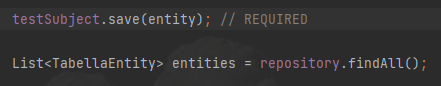
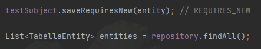
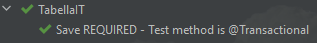
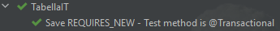
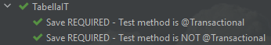
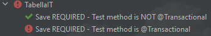
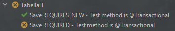
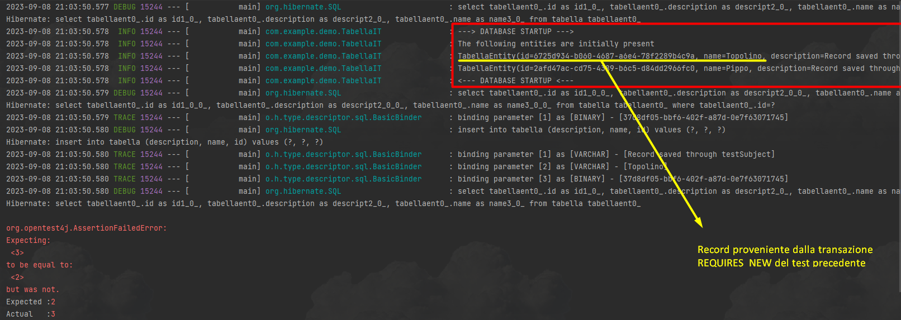

# @Transactional nei test
## Obiettivo
Indagare il comportamento dell'annotazione @Transactional nel caso REQUIRED e REQUIRES_NEW. Capire come si influenzano a vicenda nel caso di integratio test.

## Descrizione
La classe _TabellaService_ espone due metodi per salvare una entity:
<pre>
- save():            annotato con @Transactional(propagation = Propagation.REQUIRED)
- saveRequiresNew(): annotato con @Transactional(propagation = Propagation.REQUIRES_NEW)
</pre>
La classe di integration test _TabellaIT_ utilizza i metodi di salvataggio di _TabellaService_, in concomitanza con _@Transactional_ a livello di IT.\
Ogni test esegue una chiamata a _testSubject_ e successivamente recupera tutti i record presenti nella tabella.

> Caso metodo REQUIRED\

> Caso metodo REQUIRES_NEW\

Note:\
I test possono essere ordinati tramite `@Order(<ordine>)`.\
Ogni test esegue inizialmente lo script "_save.sql_" che inserisce il seguente record:\
`record = {id: '2afd47ac-cd75-4389-b6c5-d84dd2966fc0', name:'Pippo', description: 'Record saved through script'}`

## Risultati
### 1. Save REQUIRED - Test metodo @Transactional
Se il metodo di test è transazionale (transazione T1) e il salvataggio di un record avviene nella stessa transazione, tale record viene recuperato correttamente all'interno di T1.

### 2. Save REQUIRES_NEW - Test metodo @Transactional
Se il metodo di test è transazionale (_transazione padre_ T1) e il salvataggio di un record avviene in una nuova transazione (_transazione figlia_ T2, REQUIRES_NEW), tale record viene recuperato correttamente nella transazione padre T1.

### 3. Metodo del test NON @Transactional
Se un metodo del test NON è annotato con _@Transactional_, il database non viene rollbackato al termine del test e quelli successivi possono essere influenzati

> 1° caso\

> 2° caso\

Nel 2° caso, il test #2 fallisce durante l'esecuzione dello script "_save.sql_" perché il record 'Pippo' esiste già dal test precedente #1.\
`Caused by: org.h2.jdbc.JdbcSQLIntegrityConstraintViolationException: Unique index or primary key violation`\
`INSERT INTO tabella (id, name, description) VALUES ('2afd47ac-cd75-4389-b6c5-d84dd2966fc0', 'Pippo', Record saved through script')`

### 4. I dati inseriti in REQUIRES_NEW non vengono rollbackati
Se si esegue un metodo di test transazionale T1 che richiama una nuova transazione T2, allora vengono rollbackati solo i dati isneriti da T1 e non quelli di T2.

Il secondo test fallisce perché risulta presente un record in più, ovvero quello proveniente dal test precedente inserito nella transazione REQUIRES_NEW.

> Log del test fallito

